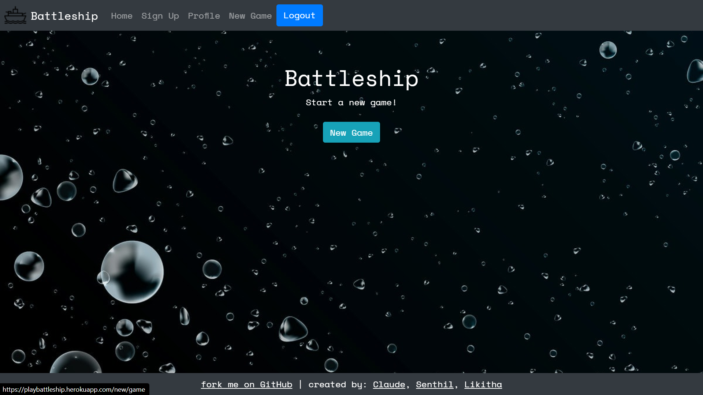
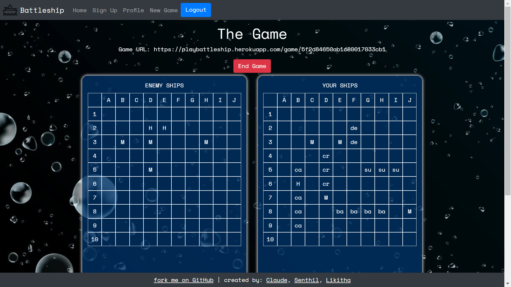

### Technologies

- MERN stack (Mongo, Express, React, Node)
- HTML
- CSS
- Bootstrap
- JavaScript

### Features

- Event listeners and handlers
- Document Object Model (DOM) manipulation
- Asynchronous JavaScript with async and await
- User information storage and password encryption - using Bcrypt
- User sign up and log in functionality
- Full CRUD functionality
- RESTful API

 

### Example Images and Descriptions

  
  

    <h5 class="card-title">Landing Page</h5>
    
Displays the instructions for how to use the site

  

  
  

    <h5 class="card-title">Sign Up Page</h5>
  

  
  

    <h5 class="card-title">Home Page</h5>
    
Default home page after login where user can start a new game

  

  
  

    <h5 class="card-title">New Game Page</h5>
  

  
  

    <h5 class="card-title">Ship Placement</h5>
    
Ships are displayed at the bottom of the new game page for a user to place them on their board and start playing the game

  

  
  

    <h5 class="card-title">Game Play</h5>
    
Locations are marked as hit (H) or miss (M) when a user clicks or the computer attacks back. User's ships are indicated on their board by their first 2 letters

  

