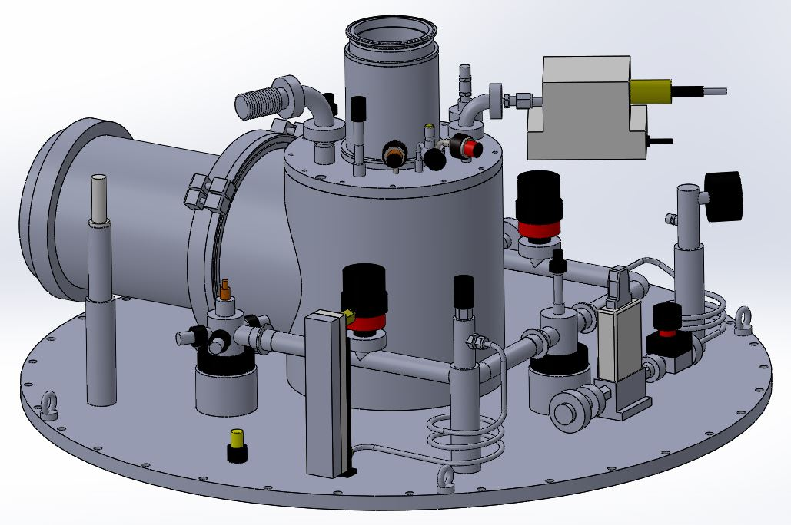
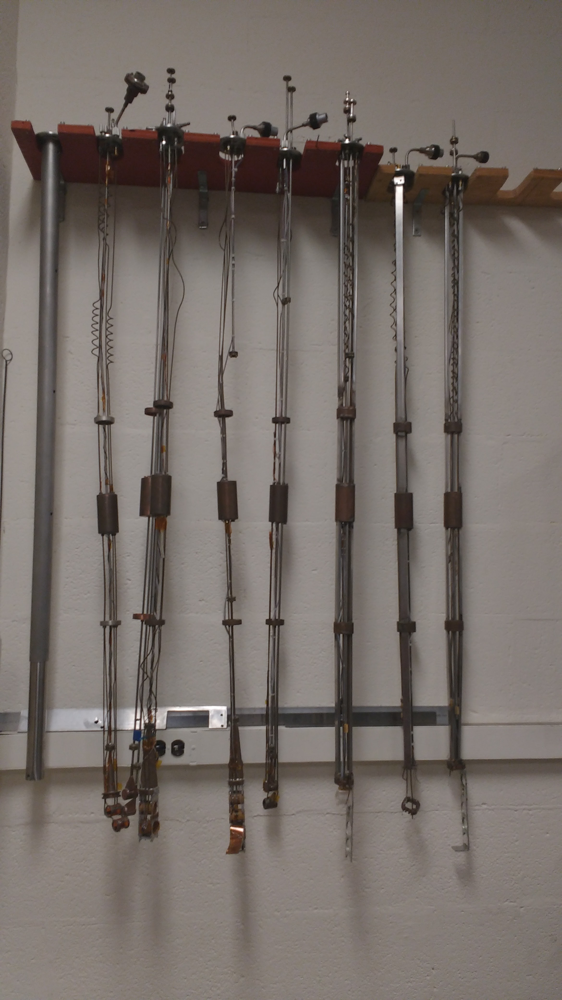
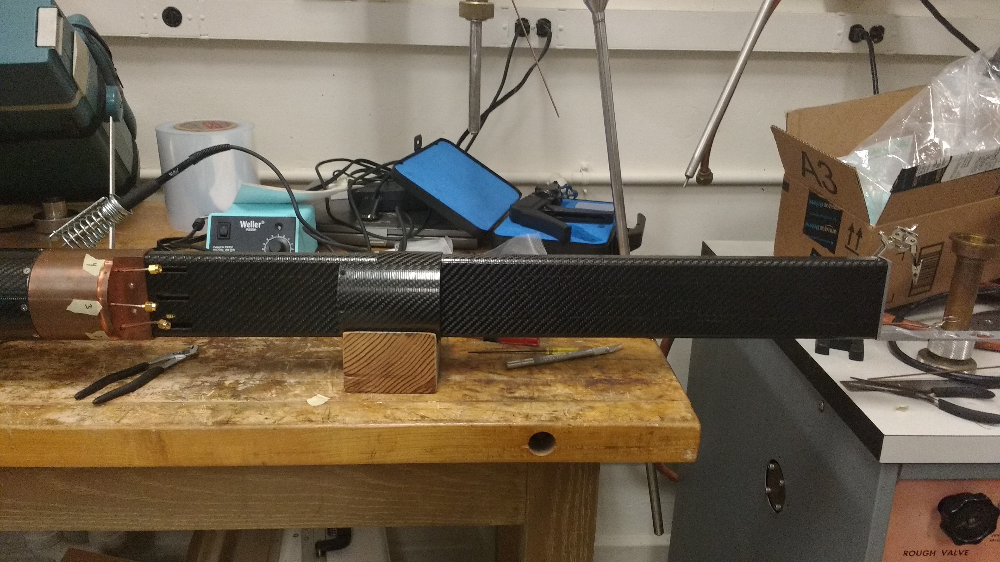
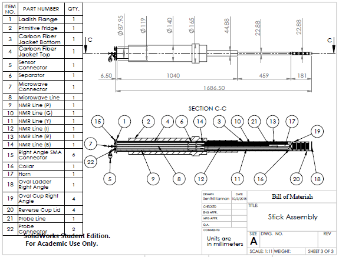
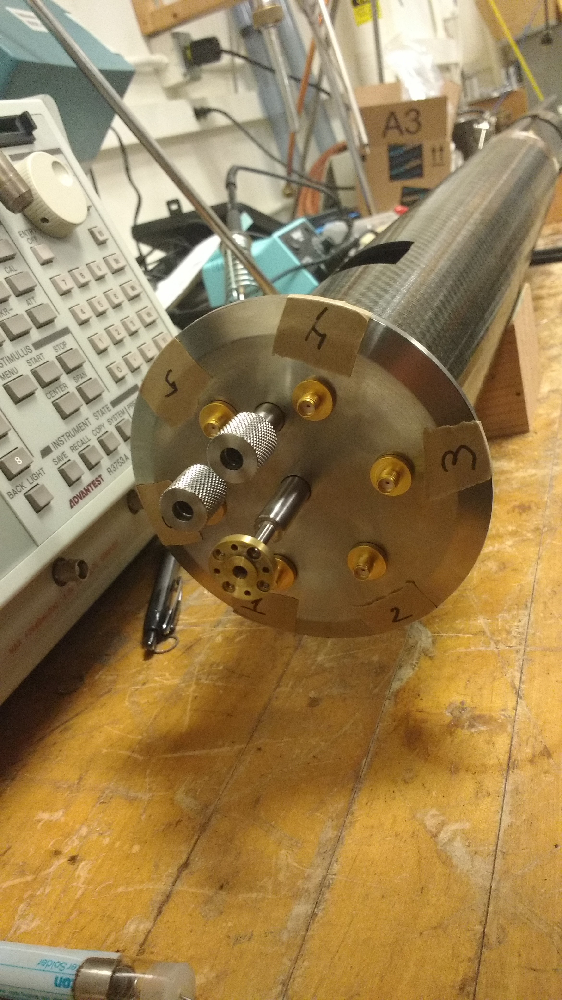
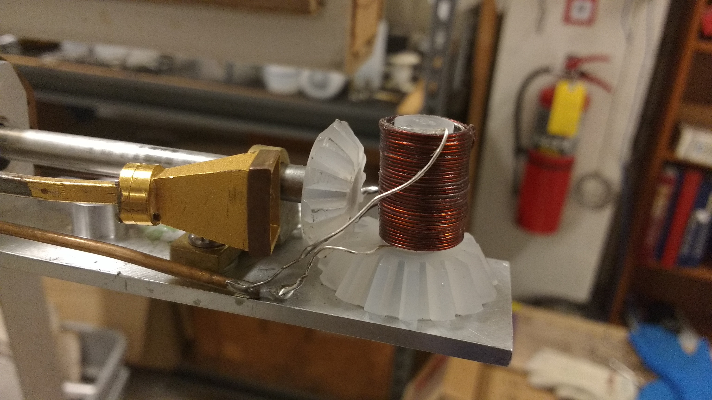

### Description

- Measured complicated parts and modeled them using SolidWorks for use in research and experiments

- Iterated and optimized designs in large assemblies, and collaborated with machinists to produce final product

- Provided detailed drawings of intricate parts to machine shop for manufacturing, adhering to standard protocol

### Technologies

- SolidWorks CAD Software
- SimulationXpress Analysis
- Finite Element Analysis

 

### Example Images and Descriptions

  
  

    <h5 class="card-title">Top Plate (Back Right)</h5>
    
This SolidWorks Model is an exact replica of the top plate of the physics lab's cryostat fridge. It includes every feature and connector so when sent to collaborating labs they can use this model for reference.

  

  
  

    <h5 class="card-title">Top Plate (Back Left)</h5>
  

  
  

    <h5 class="card-title">Top Plate (Left Side)</h5>
  

  
  

    <h5 class="card-title">Internal Specimen Holder</h5>
    
Apparatus used to hold solid polarized target sample and insert into dilution fridge

  

  
  

    <h5 class="card-title">New Carbon Fiber Specimen Holder</h5>
    
Improved redesign of apparatus used to insert samples into dilution fridge

  

  
  

    <h5 class="card-title">Bill of Materials</h5>
  

  
  

    <h5 class="card-title">Detailed Cross Section View</h5>
  

  
  

    <h5 class="card-title">SolidWorks Model Isometric View</h5>
  

  
  

    <h5 class="card-title">New Specimen Holder - Transition View</h5>
  

  
  

    <h5 class="card-title">New Specimen Holder - Top View</h5>
  

  
  

    <h5 class="card-title">3D Printed Rotating Specimen Container</h5>
  

  
  

    <h5 class="card-title">3D Printed Specimen Radiation Container</h5>
  

