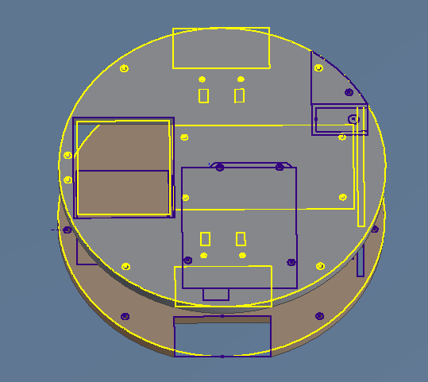

### Description

- Coded Arduino program in C to automate line-following control algorithm

- Set up online order placement using integrated SQL database and PHP scripts

- Designed 3D printed delivery system to operate with a servo, laser cut chassis of robot, wired electronic circuitry, incorporated infrared sensors and encoders

### Technologies

- SolidWorks CAD Software
- 3D Printing
- Arduino microcontroller
- C++ programming
- Circuitry design and wiring
- Laser Cutter
- Pololu Wixel 2.4 GHz radio board

 

### Example Images and Descriptions

  
  

    <h5 class="card-title">System Architecture</h5>
    
Basic layout diagram of main parts needed and their placement on the device

  

  
  

    <h5 class="card-title">Platform Diagram</h5>
    
CAD drawing of location of all cutouts on plastic chassis board. Drawing was exported and sent to laser cutter to create the platform for all the device's components.

  

  
  

    <h5 class="card-title">Delivery Robot</h5>
    <!-- picture from TLP blog, source: https://pages.shanti.virginia.edu/TLP_TLC/2016/12/07/autonomous-robot/ -->
  

