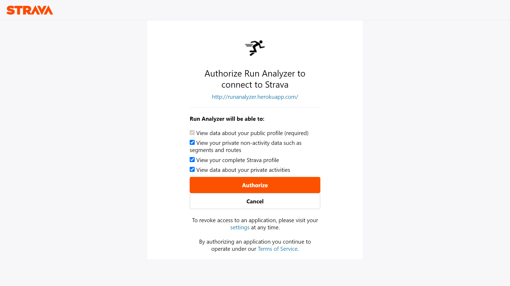
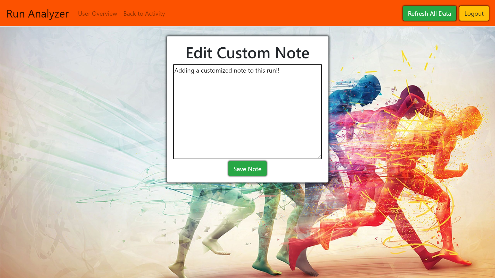
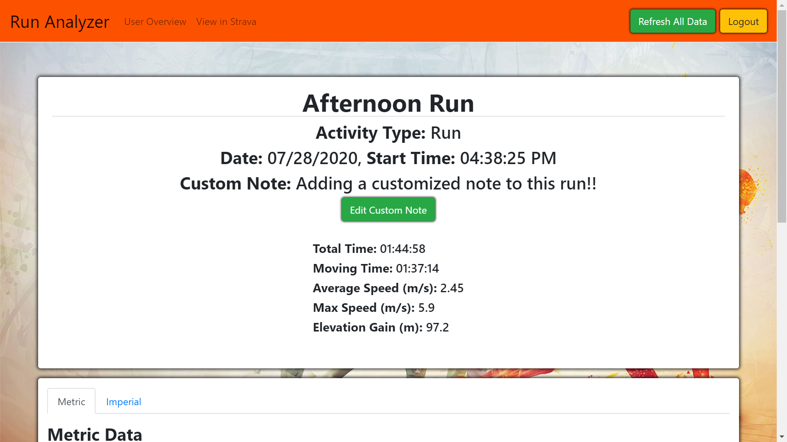

### Technologies

- HTML website
- CSS styling and animations
- Node.js
- Express.js, Express-Sessions
- EJS (Embedded JavaScript Templates), EJS Partials
- MongoDB and Mongoose
- Heroku Cloud Platform for Live Site
- jQuery and vanilla JavaScript
- Axios requests to pull external data from Strava API
- Dotenv environment variables
- Document Object Model (DOM) manipulation
- Event listeners and handlers

### Features

- Strava API Integration
- Event listeners and handlers
- jQuery & Document Object Model (DOM) manipulation
- Asynchronous JavaScript with async and await
- User information storage and authentication
- User sign up and log in functionality

 

### Example Images and Descriptions

 

  
  

    <h5 class="card-title">Sign In Page</h5>
    
Login to your personal Strava account when prompted to allow authorization to read your activity data.

  

  
  

    <h5 class="card-title">Authorization Page</h5>
    
Must grant authorization to read all of a user's Strava data in order for this site to import and analyze all activites.

  

  
  

    <h5 class="card-title">User Overview Page</h5>
    
Displays all Strava activies imported from user's account. Click refresh in the nav bar to update with any recent activities.

  

  
  

    <h5 class="card-title">Activity Show Page</h5>
    
Shows detailed data for chosen activity

  

  
  

    <h5 class="card-title">Activity Show Page Metric/Imperial</h5>
    
Data such as splits can be viewed in either miles or kilometers

  

  
  

    <h5 class="card-title">Add Custom Note</h5>
  

  
  

    <h5 class="card-title">Custom Note Displayed</h5>
  

