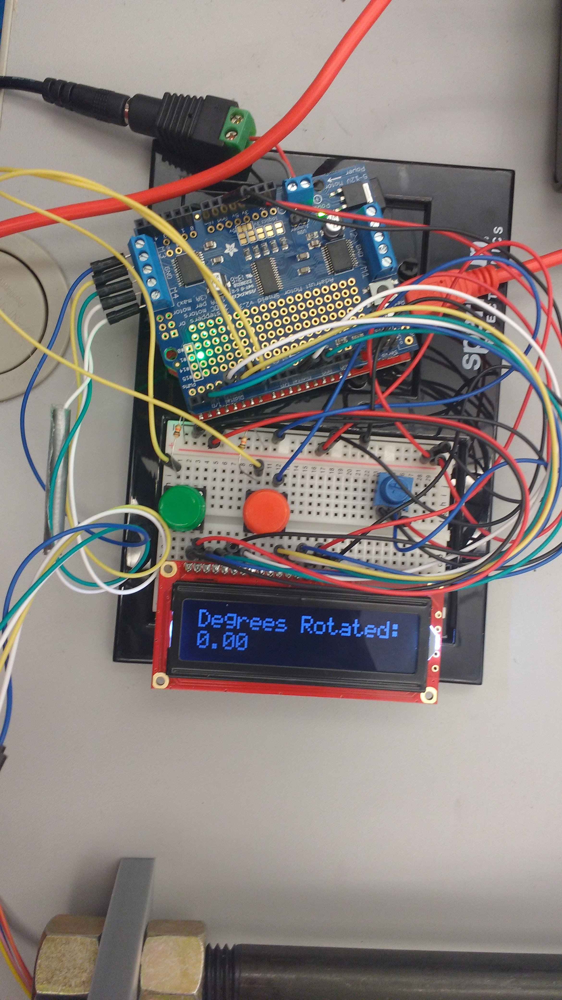
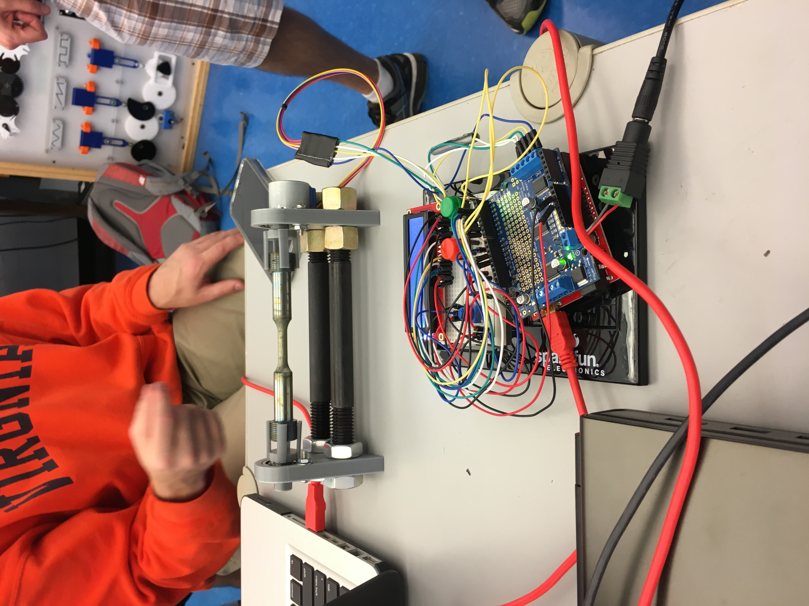

### Description

- Designed and 3D printed structure to hold cylindrical fatigue specimens of a nickel-based
  super-alloy for surface pitting characterization research

- Wired circuitry to control stepper motor with Arduino microcontroller

- Programmed Arduino in C to dynamically rotate motor based on user commands

- Two members on the team made a project post with more information here: <a href='https://pages.shanti.virginia.edu/TLP_TLC/2016/11/20/electromechanical-specimen-mount-for-surface-profilometry/' target='_blank'>https://pages.shanti.virginia.edu/TLP_TLC/2016/11/20/electromechanical-specimen-mount-for-surface-profilometry/</a>

- Videos of functional device being tested available <a href='https://youtu.be/NrVocXyONww' target='_blank'>here</a> and for a better view of the display click <a href='https://youtu.be/3Q_7IMUDgDQ' target='_blank'>here</a>

### Technologies

- SolidWorks CAD Software
- 3D Printing
- Arduino microcontroller
- C++ programming
- Circuitry design and wiring

 

### Example Images and Descriptions

  <iframe width="100%" height="400" src="https://www.youtube.com/embed/NrVocXyONww" frameborder="0" allow="accelerometer; autoplay; encrypted-media; gyroscope; picture-in-picture" allowfullscreen></iframe>
  

    <h5 class="card-title">Testing Video</h5>
  

  <iframe width="100%" height="400" src="https://www.youtube.com/embed/3Q_7IMUDgDQ" frameborder="0" allow="accelerometer; autoplay; encrypted-media; gyroscope; picture-in-picture" allowfullscreen></iframe>
  

    <h5 class="card-title">Testing Video - Display Close Up</h5>
  

  
  

    <h5 class="card-title">Side View of Mount</h5>
    
Specimen is inserted into 3D printed claw pieces which are then placed in ball bearings that are press fitted into mounts. The mounts have metal rods in the base with nuts that allow the distance between the mounts to be adjusted. A servo is connected to one of the mounts to rotate the specimen.

  

  
  

    <h5 class="card-title">Circuitry and Microcontroller</h5>
    
Potentiometer controls brightness of the display to ensure it is visible. Green and red buttons control rotation of the specimen mount. A button press rotates the specimen a set number of degrees in one direction (buttons rotate same amount in opposite directions). Arduino can be connected to computer to change the number of degrees the buttons rotate the specimen, or to modify other parameters.

  

  
  

    <h5 class="card-title">Full System</h5>
    
Shows Arduino and circuitry in the foreground with the specimen mount in the background. Arduino is currently connected to a computer as the code is being uploaded.

  

  
  

    <h5 class="card-title">3D Printed Mount</h5>
  

