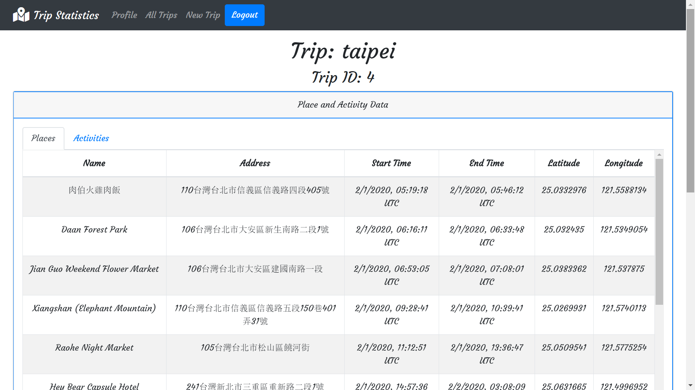

### Technologies

- React Frontend
- Python Flask (backend micro web framework)
- SQLite3 / PostgreSQL Databases
- Node
- JavaScript
- HTML
- CSS
- Bootstrap

### Features

- Google Maps API Integration
- Event listeners and handlers
- jQuery & Document Object Model (DOM) manipulation
- Asynchronous JavaScript with async and await
- User information storage and password encryption using Flask Bcrypt
- User sign up and log in functionality

 

### Example Images and Descriptions

 

  
  

    <h5 class="card-title">Landing Page</h5>
    
Displays the landing page to login/register and a link to download your Google Maps location history data

  

  
  

    <h5 class="card-title">User Profile</h5>
    
Shows basic account data and short instructions on how to use the site

  

  
  

    <h5 class="card-title">New Trip</h5>
    
Allows user to upload data for a new trip to be analyzed, or download demo files to test out if they do not have any data

  

  
  

    <h5 class="card-title">All Trips</h5>
    
Shows all trips that have been uploaded

  

  
  

    <h5 class="card-title">Trip Display Page - Data</h5>
    
Displays details on one selected trip. Place and activity data are in separated tables that can be collapsed

  

  
  

    <h5 class="card-title">Trip Display Page - Map</h5>
    
Displays details on one selected trip. Interactive heatmap containing all places with markers and labels showing more information

  

