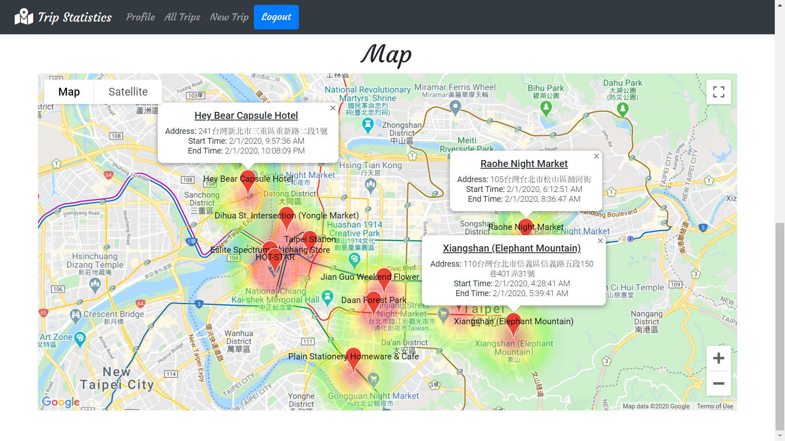

#### Technologies

- React Frontend
- Python Flask (backend micro web framework)
- SQLite3 / PostgreSQL Databases
- Node
- JavaScript
- HTML
- CSS
- Bootstrap

#### Features

- Google Maps API Integration
- Event listeners and handlers
- jQuery & Document Object Model (DOM) manipulation
- Asynchronous JavaScript with async and await
- User information storage and password encryption using Flask Bcrypt
- User sign up and log in functionality

 

    

    

    

    <h3>Landing Page</h3>
    
Displays the landing page to login/register and a link to download your Google Maps location history data

    

